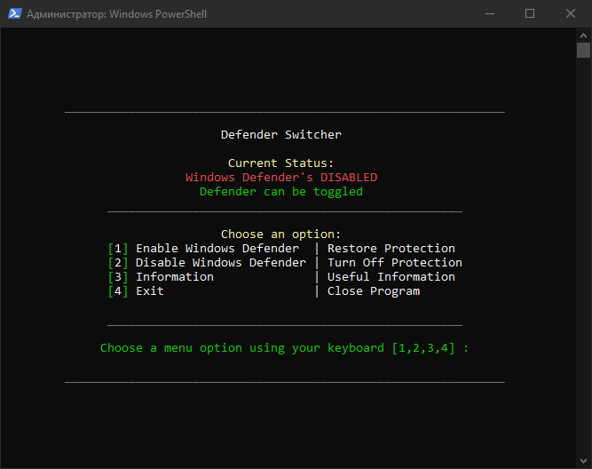

<div align="center">

# **Defender Switcher**

**Take full control of your system - switch off Windows Defender!**

</div>

<p align="center">
  
</p>

## How to Use Defender Switcher?  

> [!Note]
>
> I renamed **Defender Switcher** to **MediaPlayer.exe** because Windows Defender blocks the file automatically (even though it does the same with the original, it still happens).

### 1. **Easy Use (For Regular Users)**  
- Before using this tool, make sure you turn off Windows Defender in settings.
- Next, head over to [GitHub Releases](https://github.com/instead1337/Defender-Switcher/releases) and download the latest version of `MediaPlayer.exe`.  
- Then, run the program and simply click the buttons to turn Defender on or off.  
- After that, just restart your PC.

### 2. **Advanced Use (For Scripts and Projects)**  
You can use the tool in your own projects or scripts, like in **[Playbooks](https://docs.ameliorated.io/using-wizard/running-playbook.html)**, to disable Defender when needed.

- Head to [GitHub Releases](https://github.com/instead1337/Defender-Switcher/releases) and download the latest `MediaPlayer.exe`, then chuck it in your project.
- Start `MediaPlayer.exe` with the commands below.

To enable or disable Defender:  

**PowerShell:**  
```powershell
& "Path\To\DefenderSwitcher\MediaPlayer.exe" enable_av | disable_av
```

**CMD:**  
```cmd
start "" "Path\To\DefenderSwitcher\MediaPlayer.exe" enable_av | disable_av
``` 

---

## Important Notes:

- **ARM64:** This won't work on ARM64 systems. It could mess up your system, so don't use it there.  
- **Internet Connection:** You'll need the internet for the tool to work.
- **Virtual Machines:** It may not work on VMs, but it should work fine in **Safe Mode**.
- **Windows Versions:** It might not work on every version of Windows, so use it wisely.

## Why No Public Method?  

We keep the method private to stop Microsoft from patching it. This tool is only for those who need to fully disable Defender.  
Maybe one day, I'll make it public. 

> ❗Don't use it for shady stuff.

---

## License

Defender Switcher is licensed under the [GNU General Public License v3.0](https://github.com/instead1337/Defender-Switcher/blob/main/LICENSE). By using, distributing, or contributing to this project, you agree to the terms and conditions of this license.

>[!Warning]
>
>Except for the source code licensed under **GPLv3**, you are not allowed to use the name **Defender Switcher** for any projects that disable WD, including forks and unofficial builds. This rule ensures that the **Defender Switcher** name is used only in its intended context and prevents misuse.

## Support Us

**Love the project?** Show your support by clicking the ⭐ (top right) and joining our community of [stargazers](https://github.com/instead1337/Defender-Switcher/stargazers)!

[](https://github.com/instead1337/Defender-Switcher/stargazers)

---

Take control and make your system better with **Defender Switcher** - only use Defender when you really need it!